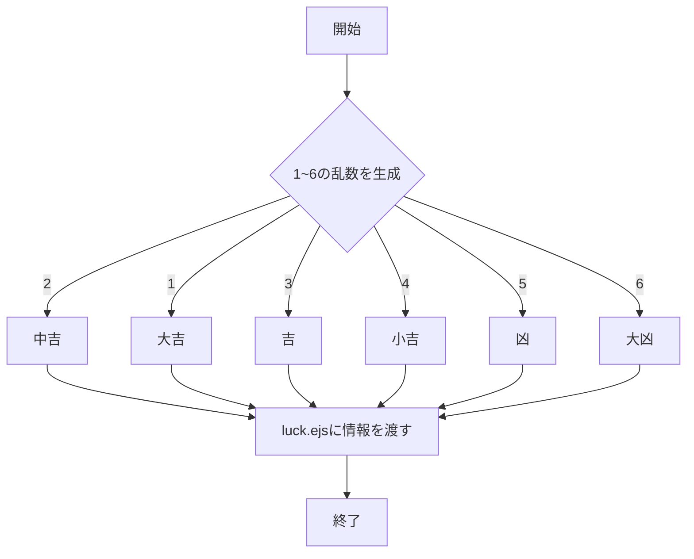
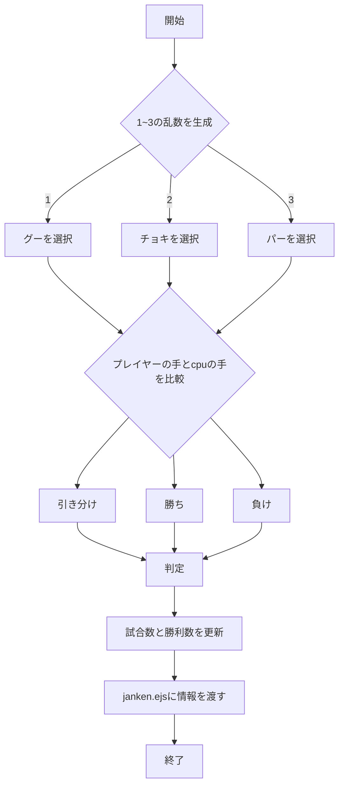
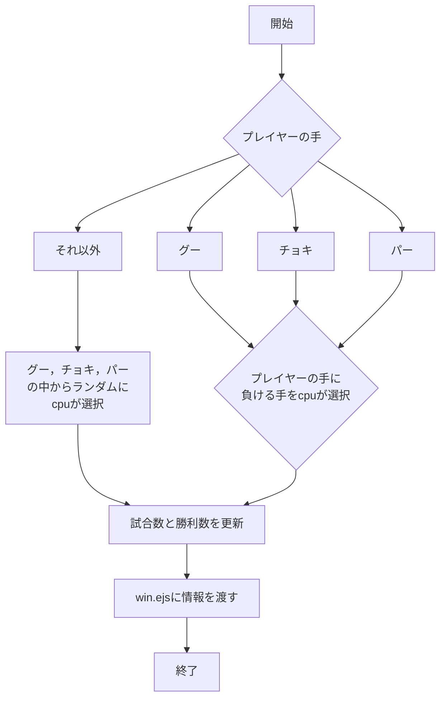
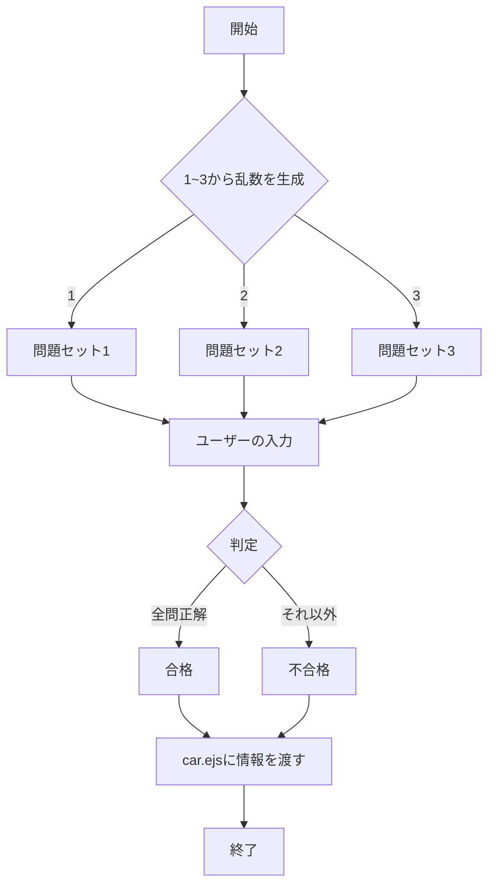

# 「webpro_06」

## このプログラムについて
このプログラムは、Nodeとhtmlを使用したWebアプリケーションで、主な機能として，じゃんけんやおみくじ、運転免許学科試験のような小さなゲームやクイズ機能を提供するものである。app5.jsに各機能のURLURLへの振り分けと処理の内容が書かれており、ユーザーはURLにアクセスするだけでこれらの機能を利用できるようになっている。

## ・起動方法
1. ターミナルでcdコマンドを使用し，webpro_06まで移動
1. 以下のコマンドを実行して必要なパッケージをインストール
```npm install```
1. インストールが完了したら、以下のコマンドで起動
```node app5.js```
## ・Gitでの管理方法
事前に，Githubのアカウントを作成し，アクセストークンを作成する必要がある．
1. ターミナルでcdコマンドを使用し，webpro_06まで移動
1. 以下のコマンドを順番に実行(コメントには変更理由や変更内容を書く)
```git add .```
```git commit -am 'コメント'```
1. 以下のコマンドを実行．(実行する際，Githubのアカウント名とアクセストークンが求められるので，正確に入力する)
```git push```
## ・ファイル一覧

ファイル名 | 説明
-|-
app5.js | プログラム本体
views/show.ejs | 2つの挨拶メッセージを表示する画面
views/icon.ejs | 画像を表示する画面
views/luck.ejs | おみくじの結果を表示する画面
views/janken.ejs | じゃんけんの結果と成績を表示する画面
views/win.ejs | じゃんけんの結果と成績を表示する画面
views/car.ejs | 運転免許の学科試験の問題を表示する画面

## 「hello1」
### hello1の機能
hello1は,挨拶メッセージを表示する機能である．
#### 手順
1. app5.js を起動する
1. Webブラウザでhttp://localhost:8080/hello1にアクセスする

## 「hello2」
### hello2の機能
hello1は,挨拶メッセージを表示する機能である．
#### 手順
1. app5.js を起動する
1. Webブラウザでhttp://localhost:8080/hello2にアクセスする

## 「icon」
### iconの機能
iconは，指定した画像を表示する機能である．
#### 手順
1. app5.js を起動する
1. Webブラウザでhttp://localhost:8080/iconにアクセスする

## 「luck」
### luckの機能
luckは，1～6の乱数を生成しておみくじを引き，その結果（大吉，中吉，吉，小吉，凶，大凶）を表示する機能である．
#### 手順
1. app5.js を起動する
1. Webブラウザでhttp://localhost:8080/luckにアクセスする
#### luckのフローチャート


## 「janken」
### jankenの機能
jankenは，ユーザーがじゃんけんを行い，CPUと勝負する機能である．
また，試合数と勝利数も表示する．
#### 手順
1. app5.js を起動する
1. Webブラウザでhttp://localhost:8080/jankenにアクセスする
1. 自分の手（グー，チョキ，パー）を入力する
1. 『送信』をクリック

#### jankenのフローチャート


## 「win」
### winの機能
winは，プレイヤーがじゃんけんを行い，CPUと勝負し，試合数と勝利数も表示する機能であるが，プレイヤーが手（グー，チョキ，パー）を選択したあとにCPUが負ける手を選択することで，プレイヤーが絶対に勝利することができる機能である．
#### 手順
1. app5.js を起動する
1. Webブラウザでhttp://localhost:8080/winにアクセスする
1. 自分の手（グー，チョキ，パー）を入力する
1. 『送信』をクリック

#### winのフローチャート


## 「car」
### carの機能
carは，運転免許の学科試験の問題集1~3のいずれかを表示し，ユーザーが回答を入力して，総合的な合否を判定する機能である．
#### 手順
1. app5.js を起動する
1. Webブラウザでhttp://localhost:8080/carにアクセスする
1. 問題に対する回答を入力する
1. 『送信』をクリック

#### carのフローチャート
